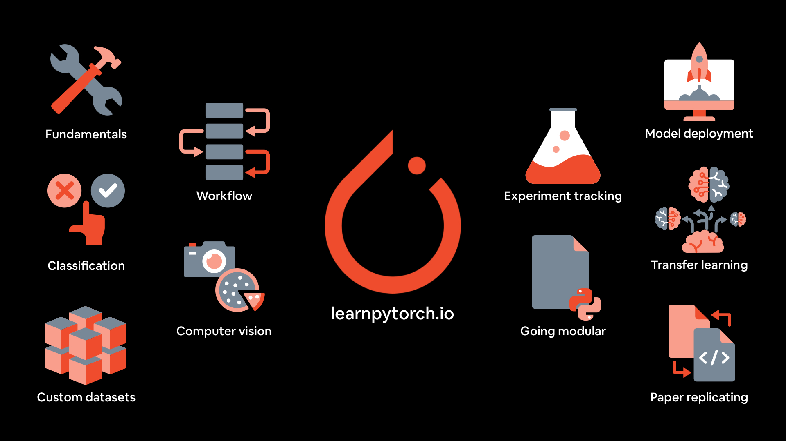

# PyTorch-Fundamentals

This repository provides a comprehensive guide to the foundational concepts of PyTorch, a popular deep learning framework.

Lessons taken from [learnpytorch.io](https://www.learnpytorch.io/)

| Section | What does it cover? |
|---|---|
| 00 - PyTorch Fundamentals  | Many fundamental PyTorch operations used for deep learning and neural networks.   |
| 01 - PyTorch Workflow  | Provides an outline for approaching deep learning problems and building neural networks with PyTorch.   |
| 02 - PyTorch Neural Network Classification   | Uses the PyTorch workflow from 01 to go through a neural network classification problem.   |
| 03 - PyTorch Computer Vision   | Let's see how PyTorch can be used for computer vision problems using the same workflow from 01 & 02   |
| 04 - PyTorch Custom Datasets   | How do you load a custom dataset into PyTorch? Also we'll be laying the foundations in this notebook for our modular code (covered in 05).   |
| 05 - PyTorch Going Modular   | PyTorch is designed to be modular, let's turn what we've created into a series of Python scripts (this is how you'll often find PyTorch code in the wild)   |
| 06 - PyTorch Transfer Learning   | Let's take a well performing pre-trained model and adjust it to one of our own problems.   |
| 07 - Milestone Project 1: PyTorch Experiment Tracking   | We've built a bunch of models... wouldn't it be good to track how they're all going?   |
| 08 - Milestone Project 2: PyTorch Paper Replicating   | PyTorch is the most popular deep learning framework for machine learning research, let's see why by replicating a machine learning paper.   |
| 09 - Milestone Project 3: Model Deployment   | So we've built a working PyTorch model... how do we get it in the hands of others? Hint: deploy it to the internet.   |

